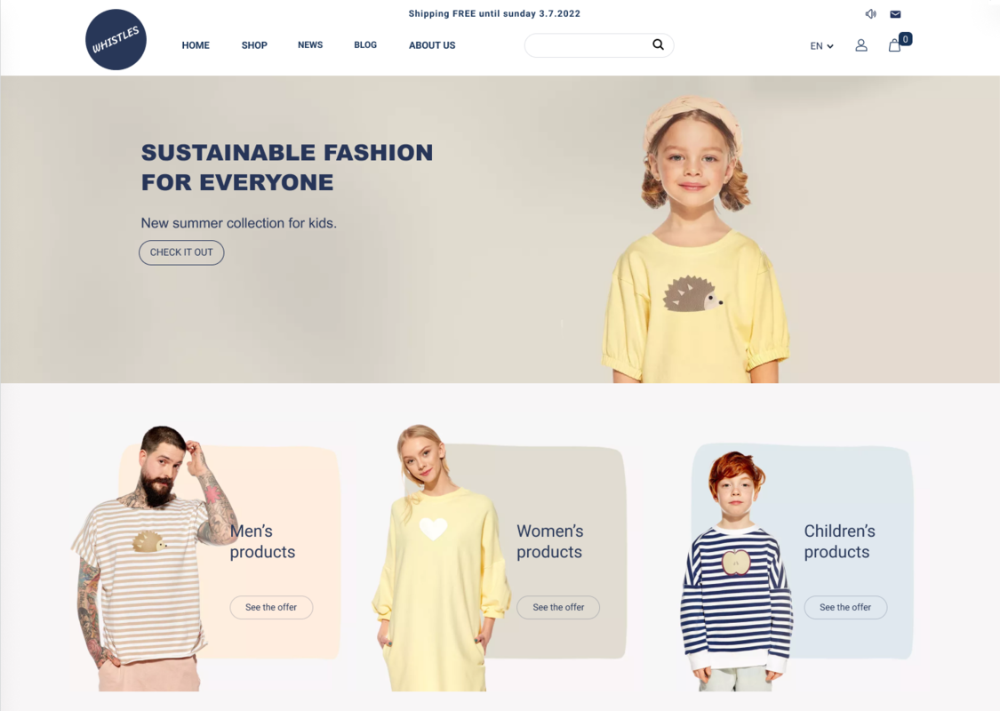

# Cognitive abilities and visual complexity impact first impressions in five-second testing

## About

This is the official repository for the research paper *"Cognitive abilities and visual complexity impact first impressions in five-second testing"*. The work addresses the validity of different time intervals for their use in the five-second testing user research method. It further evaluates the impact of user’s cognitive abilities and visual complexity of the web page on received feedback. This repository provides researchers with the dataset collected during the experiment, the experiment stimuli and data analysis scripts. Authors' contact information is also provided.


### Table of contents

* [Paper citation](#paper-citation)
* [Dataset](#dataset)
* [Designs](#designs)
* [Scripts](#scripts)
* [Authors](#authors)
* [License](#license)


## Paper citation

Not published yet.

## Dataset
In our case study, we have collected first impression testing data from participants - responses from initial and final study questionnaires, responses to follow up questions and results from cognitive ability tests. [Raw data from the UXtweak Five Second Test tool](./analysis/data/raw_data) was exported and further processed (cleaning of irrelevant data, calculation of metrics and aggregations).

[Temporary files](./analysis/data) were created during our [multi-stage analysis](#scripts). The final processed data is contained in two files, one composed of the [participant's details](./analysis/data/respondents.csv) (initial and final questionnaire, cognitive tests and related metrics), the other of [first impression answers](./analysis/data/results.csv) (including metrics and aggregations). The final data files were used in later stages of the analysis to validate the case study's hypotheses.

3 variants of [UXtweak Five Second](https://www.uxtweak.com/five-second-test-tool) Study were created to collect data during the experiment. Each variant is the same contentwise, only using different exposure times - 2, 5 and 10 seconds. The studies can be accessed below:

* Two-second test - [Results](https://app.uxtweak.com/fivesecond/results/pU1pYoCRTKitGeCuFUUpu/5zgKlJ8hq0TCW8vVTzN9C), [Study preview as participant](https://study.uxtweak.com/fivesecond/preview/pU1pYoCRTKitGeCuFUUpu/NXGaWYse3yBnUknOugr34)
* Five-second test - [Results](https://app.uxtweak.com/fivesecond/results/xUjy9IbJgfMkLbacFP11H/4ue7klaKPGsHkPk939Xau), [Study preview as participant](https://study.uxtweak.com/fivesecond/preview/xUjy9IbJgfMkLbacFP11H/4scOuv2YYGoSYMODmaznv)
* Ten-second test - [Results](https://app.uxtweak.com/fivesecond/results/gJkGgLlNe3BYGLw0DH6Ju/Vd95znDRfpchUO51xcXHP), [Study preview as participant](https://study.uxtweak.com/fivesecond/preview/gJkGgLlNe3BYGLw0DH6Ju/XMHRaHqkqLnR6qaabtB5B)


## Designs
[6 screenshots of website visual designs](./designs) were used in our case study, with one additional screenshot serving as the warmup task.

<table>
  <tr>
    <td align="center">TSHIRT</td>
    <td align="center">GLASSES</td>
    <td align="center">SPORT</td>
  </tr>
  <tr>
    <td align="center">WEATHER</td>
    <td align="center">PET</td>
    <td align="center">NEWS</td>
  </tr>
</table>


## Scripts

All of the scripts are written using Python (version 3.7.9) and other external libraries installed using pip (version 22.3.1). Scripts were executed using jupyter notebooks. A [requirements file](./analysis/requirements.txt) is provided for installing dependencies. After installing Python, the below commands can be used in the analysis directory to install the environment and launch the notebooks:
```
python -m venv .venv
.venv\Scripts\activate
pip install -r requirements.txt
jupyter notebook
```

This will create your virtual environment, install the dependencies and launch the python notebooks with the analysis files. After the installation, to launch the notebooks again, use these commands:

```
.venv\Scripts\activate
jupyter notebook
```

### **1 - [Data preparation](./analysis/scripts/1_data_preparation.ipynb)**

Loads the [raw dataset exported from UXtweak](./analysis/data/raw_data) and prepares its data for further use by other scripts (appropriate naming, formats, data transformation, etc.).


### **2 - [Result labeling](./analysis/scripts/2_results_labeling.ipynb)**

Automatic categorical labeling of some free text follow up questions for later use and preparation for manual UX expert labeling (number of words, use of words relevant to understanding).

### **3 - [Data calculation](./analysis/scripts/3_data_calculation.ipynb)**

Calculation of derived metrics from the raw data, aggregations, lemmatization, assigning participants into groups. Outputs the final [participant details](./analysis/data/respondents.csv) and [first impression answers](./analysis/data/results.csv) datasets used in further analysis. After this step, the collected and calculated data include:

Participant details:
* data from short-term memory test (passed levels)
* data from perceptual speed test (passed levels, mistakes)
* demographic information (age, gender, education, etc.)
* notes from participants
* attention check question answers
* device characteristics (device, os, browser etc.)
* other misc data (date, time taken, etc.)

First impression answers:
* task's respondent
* answers to follow-up questions and their aggregates
* task's information (complexity, design)


### **4 - Data analysis of [respondents](./analysis/scripts/4-1_respondent_stats.ipynb) and [results](./analysis/scripts/4-2_data_stats.ipynb)**

Statistical analysis of calculated metrics and respondent's data and related visualizations.

### **5 - Impact of [exposure time](./analysis/scripts/5-1_time_intervals.ipynb), [visual complexity](./analysis/scripts/5-2_visual_complexity.ipynb) and [cognitive abilities](./analysis/scripts/5-3_cognitive_abilities.ipynb)**

Testing the hypothesis on impact of time interval, visual complexity and cognitive abilities on participant's responses.

### **6 - Relationships of exposure time intervals with [visual complexity](./analysis/scripts/6_1_time_complexity.ipynb) and [cognitive abilities](./analysis/scripts/6_2_time_cognition.ipynb)**

Analyzing the relationships of time with visual complexity and cognitive abilities. Testing the possibility of prolonging or shortening the exposure time for different stimuli complexities or participants with different cognitive abilities to achieve similar answers.


## Authors

### General contact 

Email: 5stest.research([AT])gmail.com

**Eduard Kuric**\
He received his PhD degree in computer science from the [Faculty of Informatics and Information Technologies](https://www.fiit.stuba.sk/), [Slovak University of Technology in Bratislava](https://www.stuba.sk/). He is a researcher and assistant professor at the same university. His research interests include human-computer interaction, user modeling, personalized web-based systems, and machine learning. Eduard is also the head of the UX Research Department and the founder of [UXtweak](https://www.uxtweak.com/).
- [LinkedIn](https://www.linkedin.com/in/eduard-kuric-b7141280/)
- [Google Scholar](https://scholar.google.com/citations?user=MwjpNoAAAAAJ&hl=en&oi=ao)
- Email: eduard.kuric([AT])stuba.sk

**Peter Demcak**\
He received his master’s degree in computer science from the [Faculty of Informatics and Information Technologies](https://www.fiit.stuba.sk/), [Slovak University of Technology in Bratislava](https://www.stuba.sk/). He is a researcher with background in software engineering, whose current topics of interest involve user behavior, human-computer interaction, UX research methods & design practices, and machine learning. Currently occupies the position of a scientific and user experience researcher at [UXtweak](https://www.uxtweak.com/), with focus on research that supports work of UX professionals.
- Email: peter.demcak([AT])uxtweak.com

**Matus Krajcovic**\
User experience researcher at [UXtweak](https://www.uxtweak.com/) and computer science student at [Faculty of Informatics and Information Technologies](https://www.fiit.stuba.sk/), [Slovak University of Technology in Bratislava](https://www.stuba.sk/). Currently focuses on data analysis and research in machine learning use in the field of human-computer interaction.
- [LinkedIn](https://linkedin.com/in/matus-krajcovic)
- Email: matus.krajcovic([AT])uxtweak.com

**Giang Nguyen**\
She is a senior researcher and associate professor at [Faculty of Informatics and Information Technologies](https://www.fiit.stuba.sk/), [Slovak University of Technology in Bratislava](https://www.stuba.sk/). She focuses on machine learning, deep learning, soft computing, and security and reliability. She is also a reviewer and editor for Web of Science journals and member of program committee, editor, organizator for international conferences.
- [LinkedIn](https://www.linkedin.com/in/giang-nguyen-3307b8b/)
- [Google Scholar](https://scholar.google.com/citations?hl=en&user=IEmgzZkAAAAJ)
- Email: giang.nguyen([AT])stuba.sk

## License
This work is licensed under a [Creative Commons Attribution-NonCommercial 4.0 International License](http://creativecommons.org/licenses/by-nc/4.0/).

[](http://creativecommons.org/licenses/by-nc/4.0/)
